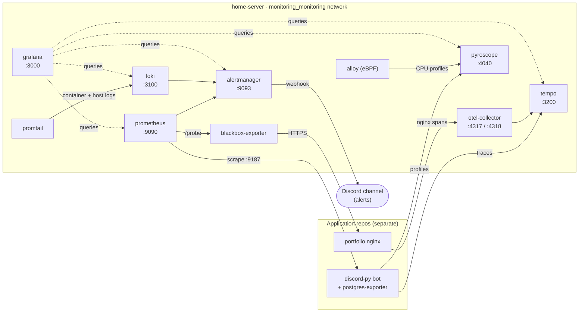

# home-server

> Central infrastructure for the self-hosted box behind **[yoram-izilov.com](https://www.yoram-izilov.com)** - the observability stack and the Jenkins controller that the application repos plug into.


This repo owns the **shared services** a single self-hosted host runs - not the apps themselves. The Discord bot ([`discord-py`](https://github.com/Yoram-Izilov/discord-py)) and the portfolio site ([`portfolio`](https://github.com/Yoram-Izilov/portfolio)) live in their own repos and *consume* the infrastructure defined here. Everything in this repo is declarative config - Docker Compose, Prometheus rules, Grafana dashboards, Alertmanager routing - there is no application code.

Today it holds the **monitoring stack** (`monitoring/`) and the **Jenkins controller** (`jenkins/`). The host **nginx** reverse proxy is planned to move in next (`nginx/`).

> For the authoritative deep-dive, see [`monitoring/CLAUDE.md`](monitoring/CLAUDE.md) and [`jenkins/CLAUDE.md`](jenkins/CLAUDE.md). This README is the operator's overview.

## Architecture

Two external Docker networks are the contract between this repo and the apps. `home-server` owns them; the apps attach to them. A service that needs both observability *and* public routing joins both.



- **`monitoring_monitoring`** - created by `docker compose -p monitoring`. The bot joins it to emit traces (`tempo:4317`) and profiles (`pyroscope:4040`), and to expose `postgres-exporter:9187` for Prometheus. The portfolio container joins it so nginx can ship spans to `otel-collector:4317`. **Never rename it** - renaming silently detaches the apps with no error.
- **`nginx_nginx_network`** - the host nginx reverse-proxy network (planned to live here). The `portfolio` container joins it; nginx routes `www.yoram-izilov.com` → `http://portfolio:80/` by container name.

## The stack

Eleven services, all defined in [`monitoring/docker-compose.yml`](monitoring/docker-compose.yml) on the `monitoring` network. Every image is pinned to an exact tag.

| Service | Image | Port | Purpose |
|---|---|---|---|
| `prometheus` | `prom/prometheus:v3.11.3` | 9090 | Metrics + alert-rule evaluation. Rules in `prometheus/rules/`. |
| `node-exporter` | `prom/node-exporter:v1.11.1` | host | Host system metrics (`network_mode: host`). |
| `grafana` | `grafana/grafana:13.0.1` | 3000 | Dashboards + datasources, provisioned from `grafana/`. |
| `loki` | `grafana/loki:3.7.2` | 3100 | Log aggregation. Log-based rules in `loki/rules/fake/`. |
| `promtail` | `grafana/promtail:3.4.1` | - | Ships Docker + `/var/log` logs to Loki. |
| `tempo` | `grafana/tempo:2.10.5` | 3200 | Trace storage. Receives OTLP on 4317. |
| `otel-collector` | `otel/opentelemetry-collector-contrib:0.111.0` | 4317/4318 | OTel gateway → Tempo. |
| `alertmanager` | `prom/alertmanager:v0.28.1` | 9093 | Routes alerts → Discord webhook. |
| `pyroscope` | `grafana/pyroscope:1.10.0` | 4040 | Continuous profiling. |
| `blackbox-exporter` | `prom/blackbox-exporter:v0.27.0` | - | Black-box HTTP/TLS uptime probe of the public site. |
| `alloy` | `grafana/alloy:v1.10.0` | - | eBPF profiler for the portfolio nginx (`privileged` + `pid: host`). |

`postgres-exporter` is **not** here - it lives in [`discord-py`](https://github.com/Yoram-Izilov/discord-py)'s compose (it's the bot's database) and joins `monitoring_monitoring`, where this Prometheus scrapes it at `postgres-exporter:9187`.

**Scrape jobs** ([`prometheus.yml`](monitoring/prometheus/prometheus.yml), 5s interval): `prometheus`, `node-exporter` (`host.docker.internal:9100`), `alertmanager`, `loki`, `tempo`, `grafana`, `otel-collector` (`:8888`), `postgres-exporter` (`:9187`), and `blackbox-portfolio` (probes `https://www.yoram-izilov.com`).

## Repo layout

```
home-server/
├── monitoring/                  # the observability stack  (see monitoring/CLAUDE.md)
│   ├── docker-compose.yml       # 11 services on the `monitoring` network
│   ├── prometheus/
│   │   ├── prometheus.yml       # scrape jobs (5s) + alertmanager target
│   │   └── rules/               # alerts: host, stack, app, postgres, portfolio
│   ├── grafana/                 # provisioning/ (datasources, dashboards) + dashboards/
│   ├── loki/                    # loki-config.yaml + LogQL rules in rules/fake/
│   ├── promtail/ tempo/ opentelemetry/ alloy/ blackbox/   # per-service config
│   └── alertmanager/
│       ├── alertmanager.yml     # routes to Discord via webhook_url_file:
│       └── discord-webhook-url  # gitignored secret, injected at deploy
├── jenkins/                     # the CI controller       (see jenkins/CLAUDE.md)
│   ├── docker-compose.yaml      # jenkins + socat (exposes host Docker over TCP)
│   └── Dockerfile               # jenkins/jenkins:jdk21 + Docker CLI + rsync
├── nginx/                       # PLANNED: host reverse proxy
├── Jenkinsfile                  # deploys the monitoring stack
└── CLAUDE.md
```

## Quick start (local)

```bash
cd monitoring

# secrets (gitignored): admin password + the Discord alert webhook
echo 'GRAFANA_ADMIN_PASSWORD=changeme' > .env
printf '%s' 'https://discord.com/api/webhooks/...' > alertmanager/discord-webhook-url

# bring the stack up - the -p monitoring project name is REQUIRED (see Invariants)
docker compose -p monitoring up -d
```

Then: **Grafana** → http://localhost:3000 · **Prometheus** → http://localhost:9090 · **Alertmanager** → http://localhost:9093 · **Loki** → http://localhost:3100 · **Tempo** → http://localhost:3200 · **Pyroscope** → http://localhost:4040.

The Jenkins controller is brought up separately from `jenkins/` (`docker compose up -d --build`).

## Configuration & secrets

Secrets are never committed (the `block-sensitive-files` hook blocks `git add` of them). Locally they're plain files you create by hand; in production they come from Jenkins credentials.

| What | Local file (gitignored) | Production source |
|---|---|---|
| Grafana admin password | `monitoring/.env` → `GRAFANA_ADMIN_PASSWORD` | Jenkins credential `grafana-admin-password` |
| Discord alert webhook | `monitoring/alertmanager/discord-webhook-url` | Jenkins credential `discord-alertmanager-webhook-url` |

Also gitignored: any `*.key`, `*.pem`, `*-webhook-url`, `*.htpasswd`.

## Deployment

The root [`Jenkinsfile`](Jenkinsfile) deploys the monitoring stack on merge to `main`:

1. **Deploy** - `rsync -a --delete monitoring/` to `MONITORING_DEPLOY_PATH` on the host (default `/home/izilov/Desktop/home-server-monitoring`), write the webhook secret, then `docker compose -p monitoring -f .../docker-compose.yml up -d`, then **restart Prometheus** (see gotcha below).
2. **Remove Dangling Images** - prune leftover layers.
3. **Verify** - assert `prometheus`, `grafana`, `alertmanager`, `loki`, `tempo` are running.

Config linting is **not** in the pipeline - validate locally before pushing (see [Verifying changes](#verifying-changes)).

## Operational notes - do not break these

- **`-p monitoring` is mandatory.** It pins the Compose project name so the network resolves to `monitoring_monitoring`, the exact name the apps attach to as `external`. Drop the flag or rename the network and the bot silently stops tracing.
- **Prometheus config-reload gotcha.** Prometheus doesn't watch its bind-mounted config, and `up -d` won't recreate it when only `prometheus.yml`/`rules/` changed - a plain deploy leaves the *old* config running. The Jenkinsfile therefore `restart`s Prometheus after deploy (the TSDB survives in the `prometheus_data` volume). If you change scrape targets or rules out-of-band, restart Prometheus yourself.
- **Pin every image.** Exact tags only, never `:latest` - reproducible deploys. The `warn-unpinned-image` hook nudges on drift.
- **Host-path bind-mount rule.** Jenkins runs in a container but drives the *host* Docker daemon, so the bind-mount paths in `docker-compose.yml` are resolved by the host. The deploy rsyncs the tree to `MONITORING_DEPLOY_PATH` and runs Compose from there. The Jenkins container must bind-mount that path at the **same** location. If you change `MONITORING_DEPLOY_PATH`, update the Jenkins container's bind mount to match.
- **Never inline the webhook URL.** `alertmanager.yml` reads it via `webhook_url_file:`; the secret is injected at deploy time.
- **OTel collector binds `0.0.0.0:4317/4318`** explicitly - newer collectors default to loopback, which would silently drop the portfolio's spans.
- **Loki rules (LogQL) ≠ Prometheus rules (PromQL).** Both alert into the same Alertmanager, but they live in different places (`loki/rules/fake/` vs `prometheus/rules/`).

## Conventions

- **Branch + PR, never push to `main`.** Branches: `feat/<slug>`, `fix/<slug>`, `chore/<slug>`.
- **Commit format** `<type>(<scope>): <summary>`, enforced by the `verify-commit-message` hook. Types: `feat · fix · refactor · chore · docs · style`. Scopes: `monitoring · prometheus · grafana · loki · tempo · promtail · alertmanager · pyroscope · compose · jenkins · nginx · docs`.
- **`.claude/` skills** - `/add-monitored-service` wires a new scrape target + starter alerts; `/sync-monitoring-config` audits the stack for drift.

## Verifying changes

```bash
# config parses
docker compose -p monitoring -f monitoring/docker-compose.yml config >/dev/null

# rules + alertmanager lint
docker run --rm -v "$PWD/monitoring/prometheus:/etc/prometheus:ro" --entrypoint sh \
  prom/prometheus:v3.11.3 -c 'promtool check config /etc/prometheus/prometheus.yml && promtool check rules /etc/prometheus/rules/*.yml'
docker run --rm -v "$PWD/monitoring/alertmanager:/cfg:ro" --entrypoint amtool \
  prom/alertmanager:v0.28.1 check-config /cfg/alertmanager.yml

# bring it up; confirm targets healthy at http://localhost:9090/targets
docker compose -p monitoring up -d
```

Or run `/sync-monitoring-config` for a read-only drift audit (missing scrape targets, dangling rule files, unpinned images, broken datasource URLs).

## Part of the yoram-izilov.com stack

| Repo | Role |
|---|---|
| **home-server** (this repo) | Monitoring stack + Jenkins controller; owns the shared Docker networks. |
| [discord-py](https://github.com/Yoram-Izilov/discord-py) | Discord bot; emits traces/profiles here, exposes `postgres-exporter`. |
| [portfolio](https://github.com/Yoram-Izilov/portfolio) | SvelteKit site; monitored end-to-end from this stack. |
